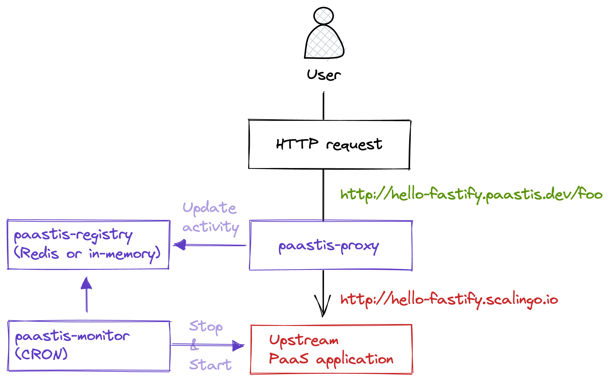

# Paastis

**🚀 Optimize your PaaS experience.**

### Why

Paastis helps development teams or workers that build and manage many PaaS applications with few usage (ex: demo, ephemeral or in-progress apps) to optimize their resource consumption.

### How

Paastis automatically scales down (to-zero) and up (to-x) PaaS applications according to their idle time.

Rather than running apps with no trafic unnecessarily, Paastis automatically stops it after an optimized delay (configurable, for all apps or by app or group of apps).

If an app is requested, whether it is active or not, then Paastis acts as a proxy and forwards the request with all its attributes (headers, query and/or body params) to the upstream PaaS application (after eventually waking it up).

### What

Paastis is a Node.js server app, library and CLI.

Paastis is open source, under license AGPL-3.0, [hosted on GitHub](https://github.com/paastis/paastis).

Paastis is distributed on [the npm Registry](https://www.npmjs.com/paastis/paastis).

### Who

Paastis is aimed for development teams and workers that use PaaS and Cloud hosting services.

Thus, really great attention is paid to Developer Experience.

### When

Paastis fits organizations with one or multiple applications with few usage:
- development applications, and especially _review apps_ ;
- projects at their very beginning ;
- platforms with very cyclic, part-time or known time slots (ex: a scholar-based app, a midday exclusive service, a nightly treatment, etc.).

### Where

Paastis currently works for users of the following Cloud hosting providers:
- [Heroku](https://heroku.com)
- [Scalingo](https://scalingo.com)
- [Clever Cloud](https://clever-cloud.com)

Other providers will be added in the future : [render.com](https://render.com/), [Netlify](https://netlify.com), [Kubernetes](https://kubernetes.io/), [Vercel](https://vercel.com/), [platform.sh](https://platform.sh/), etc.

## Getting started

**1/** Generate and get your target PaaS (Heroku, Scalingo, Clever Cloud) API key / token / credentials (with rights to scale up and down entities).

Resources:
- [Heroku](https://help.heroku.com/PBGP6IDE/how-should-i-generate-an-api-key-that-allows-me-to-use-the-heroku-platform-api)
- [Scalingo](https://doc.scalingo.com/platform/deployment/continuous-integration/deploy-scalingo-from-gitlab#scalingo-api-token)
- [Clever Cloud](https://www.clever-cloud.com/doc/extend/cc-api/)

**2/** Use `npx paastis` to fetch and run an instance of Paastis.

```shell
# Heroku (default provider)
$ PROVIDER_HEROKU_API_TOKEN=tk-us-xxx npx paastis

# Scalingo
$ PROVIDER_NAME=scalingo PROVIDER_HEROKU_API_TOKEN=tk-us-xxx npx paastis

# Clever CLoud
$ PROVIDER_NAME=clever-cloud \
PROVIDER_CLEVER_OAUTH_CONSUMER_KEY=xxx \
PROVIDER_CLEVER_OAUTH_CONSUMER_SECRET=xxx \
PROVIDER_CLEVER_TOKEN=xxx \
PROVIDER_CLEVER_SECRET=xxx \
npx paastis
```

By default, the proxy listens on port `3000`.

> 💡 You can add a `.env` and `paastis.yml` file(s) (cf. below) to configure your instance.

**3/** Query your target app / dyno / pod resource with paastis URL (`localhost:3000`) including request header `Host`. Only the final subdomain (i.e. the first part of the URL) matters.

```shell
# for a PaaS app named "my-paas-app"
$ curl -v localhost:3000 -H "Host: my-paas-app.proxy.paastis.localhost"

# for the app resource /api/v1/products
$ curl -v localhost:3000/api/v1/products -H "Host: my-paas-app.proxy.paastis.localhost"
```

If the upstream exists:
- if it is sleeping, then it will be awake
- else it will be called with given URI, headers and parameters (query and body)
- finally, your resource will be served

… else an error will be thrown.

## Features



Scenario :
1. Auto-discovery: Paastis detects that there is a new review app on Scalingo ; it begins to monitor it
2. Scale-to-zero: If the app is not accessed during the next 15mn (editable duration), then it is shut down (but not delete)
3. Run on-demand: If someone wants to finally access the app, then it is awakened
4. Smart proxy: Thus, the engine proxies the HTTP request to the upstream desired location

Paastis supports **multiple PaaS providers** (but not yet all their regions) :
- Clever Cloud
- Heroku
- Scalingo

It is also possible to define Shell commands (a.k.a. **hooks**) to be executed for each application on the following phases :
- before an app to be stopped
- after it stopped
- before an app to be started
- after it started

Sometimes, we do not want to monitor and manage some apps (for example, an instance of Paastis engine 😙).
We can exclude / **ignore apps to me managed** (with environment variable `REGISTRY_IGNORED_APPS`.

## Architecture

Paastis is composed of 3 main building blocks :
- a **proxy** that forwards ingoing HTTP requests to an upstream server (based on the predefined PaaS provider)
- a **registry** of the running PaaS applications to monitor (in-memory or Redis-based)
- a **scheduler** (cron-based) that regularly (every minute by default) :
  - checks for new apps to monitor (due to manual or automated creation)
  - remove apps with too big idle time (greater than predefined value)


## Installation

```shell
# 1/ Fetch sources
git clone git@github.com:paastis/paastis.git

# 2/ Enter project directory
cd paastis

# 3/ Generate and edit .env file (especially, define SCALINGO_API_TOKEN value with your own API key)
cp sample.env .env

# 4/ Install project dependencies
npm install

# 5/ Start project
npm start

# 6/ Enjoy
curl -v http://localhost:3000 -H Host:my-cloud-app.proxy.example.com
```

## Configuration

### Environment variables

| Variable                              | Required                                | Type    | Format                                | Default                      |
|---------------------------------------|-----------------------------------------|---------|---------------------------------------|------------------------------|
| HOST                                  | false                                   | String  | IP or name                            | 0.0.0.0                      |
| PORT                                  | false                                   | Number  | Number                                | 3000                         |
| REGISTRY_TYPE                         | false                                   | String  | "in-memory" or "redis"                | in-memory                    |
| REGISTRY_IGNORED_APPS                 | false                                   | String  | List of strings, separated by a comma | -                            |
| REGISTRY_REDIS_URL                    | false                                   | String  | redis://<host/>:<port/>               | -                            |
| START_AND_STOP_CHECKING_INTERVAL_CRON | false                                   | String  | CRON expression                       | * * * * *                    |
| START_AND_STOP_MAX_IDLE_TIME          | false                                   | Number  | Number of minutes                     | 15                           |
| PROVIDER_NAME                         | **true**                                | String  | "scalingo" or "clever-cloud"          | -                            |
| PROVIDER_REGION                       | false                                   | String  | "osc-fr1", "rbx", etc.                | -                            |
| PROVIDER_SCALINGO_API_TOKEN           | only if PROVIDER_NAME is "scalingo"     | String  | Token string                          | -                            |
| PROVIDER_SCALINGO_OPERATION_TIMEOUT   | false                                   | Number  | Number of seconds                     | -                            |
| PROVIDER_HEROKU_API_TOKEN             | only if PROVIDER_NAME is "heroku"       | String  | Token string                          | -                            |
| PROVIDER_HEROKU_OPERATION_TIMEOUT     | false                                   | Number  | Number of seconds                     | -                            |
| PROVIDER_CLEVER_API_HOST              | false                                   | String  | URL                                   | https://api.clever-cloud.com |
| PROVIDER_CLEVER_OAUTH_CONSUMER_KEY    | only if PROVIDER_NAME is "clever-cloud" | String  | Token string                          | -                            |
| PROVIDER_CLEVER_OAUTH_CONSUMER_SECRET | only if PROVIDER_NAME is "clever-cloud" | String  | Token string                          | -                            |
| PROVIDER_CLEVER_TOKEN                 | only if PROVIDER_NAME is "clever-cloud" | String  | Token string                          | -                            |
| PROVIDER_CLEVER_SECRET                | only if PROVIDER_NAME is "clever-cloud" | String  | Token string                          | -                            |
| PROVIDER_CLEVER_OPERATION_TIMEOUT     | false                                   | Number  | Number of seconds                     | 60                           |
| HOOKS_BEFORE_START                    | false                                   | String  | Shell command(s)                      | -                            |
| HOOKS_AFTER_START                     | false                                   | String  | Shell command(s)                      | -                            |
| HOOKS_BEFORE_STOP                     | false                                   | String  | Shell command(s)                      | -                            |
| HOOKS_AFTER_STOP                      | false                                   | String  | Shell command(s)                      | -                            |
| ROUTING_SYSTEM_API_ENABLED            | false                                   | Boolean |                                       | false                        |
| ROUTING_SYSTEM_API_TOKEN              | false                                   | String  | xxx-yyy-zzz                           | -                            |

### App rules

Declare a file `paastis.yml` (or copy and rename `paastis.yml.sample`).

You can set or edit the following `RunningApp.js` properties :
- `app_name` → set `RunningApp.name`
- `app_max_idle_time` → set `RunningApp.maxIdleTime`
- `linked_apps` → set (without any concatenation) `RunningApp.linkedApps`

```yaml
rules:
  - pattern: 'app-review-pr(\d+)-(back|front)'
    linked_apps:
      - 'app-review-pr$1-front'

  - pattern: 'hello-fastify'
    linked_apps:
      - 'hellofastifydeux'

  - pattern: 'hello-fastify-2'
    app_name: 'hellofastifydeux'

  - pattern: '.*fastify.*'
    app_max_idle_time: 0
```

## Docker

**1/** Build the Docker image

```shell
$ docker build -t paastis .
```

> 💡 If you define a file `paastis.yml` it will be added to the image.

**2/** Run a container

```shell
$ docker run \
-it --rm -p 3000:3000 \
--name paastis \
-e PROVIDER_SCALINGO_API_TOKEN=tk-us-xxx \
-e ROUTING_SYSTEM_API_ENABLED=true \
-e ROUTING_SYSTEM_API_TOKEN=abcd-1234-EFGH-5678 \
paastis
```

**3/** Test

```shell
$ curl -v localhost:3000 -H "Host: my-app.proxy.example.net"
$ curl -v localhost:3000/apps -H "PaastisProxyTarget: system" -H "PaastisProxySystemApiToken: abcd-1234-EFGH-5678" | jq .
```

## License

[](https://www.gnu.org/licenses/agpl-3.0.html)
