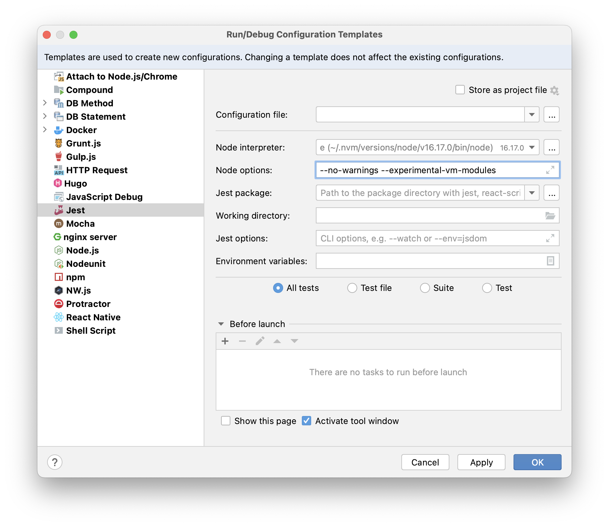

# 2022-09-24 - 🧢 Back dans les bacs

Retour aux affaires après 1 semaine de séminaire en Touraine.

## 🌴 Nouvelle arborescence

Ça devenait le bazar dans les sources.

Afin de préparer la mise en place de tests et pour rendre le code plus modulaire et manipulable : 

- déclaration et organisation autour d'un package `/src`
- définition des classes `Server` et `Scheduler` afin de faciliter les futurs tests auto et de rendre ces 2 notions centrales explicites et visibles

Gains potentiels :
- plus facile de passer à du TypeScript
- possibilité d'exporter ces classes dans un binaire npm

## 📜 Lister les apps

```shell
# Requires `jq` to be installed
$ curl -v localhost:3000/apps -H "PaastisProxyTarget: system" -H "PaastisProxySystemApiToken: abcd-1234-EFGH-5678" | jq .

# Result
[
  {
    "created_at": "2022-09-06T06:28:56.526Z",
    "force_https": false,
    "git_url": "git@ssh.osc-fr1.scalingo.com:hello-fastify.git",
    "id": "xxxxxxxxxxxxxxxxxxxxxxxx",
    "last_deployed_at": "2022-09-07T10:26:41.024Z",
    "name": "hello-fastify",
    "region": "osc-fr1",
    "status": "stopped",
    "updated_at": "2022-09-24T08:37:01.015Z",
    "url": "https://hello-fastify.osc-fr1.scalingo.io",
    "is_monitored": false
  },
  {
    "created_at": "2022-09-06T06:31:59.201Z",
    "force_https": true,
    "git_url": "git@ssh.osc-fr1.scalingo.com:paastis-proxy.git",
    "id": "xxxxxxxxxxxxxxxxxxxxxxxx",
    "last_deployed_at": "2022-09-12T21:59:41.152Z",
    "name": "paastis-proxy",
    "region": "osc-fr1",
    "status": "stopped",
    "updated_at": "2022-09-12T22:00:11.225Z",
    "url": "https://paastis-proxy.osc-fr1.scalingo.io",
    "is_monitored": false
  },
  {
    "created_at": "2022-09-07T13:47:42.781Z",
    "force_https": false,
    "git_url": "git@ssh.osc-fr1.scalingo.com:hellofastifydeux.git",
    "id": "xxxxxxxxxxxxxxxxxxxxxxxx",
    "last_deployed_at": "2022-09-07T13:51:58.667Z",
    "name": "hellofastifydeux",
    "region": "osc-fr1",
    "status": "stopped",
    "updated_at": "2022-09-17T12:22:01.363Z",
    "url": "https://hellofastifydeux.osc-fr1.scalingo.io",
    "is_monitored": false
  }
]
```

## 🦾 Enhanced apps

Un des problèmes actuels est la gestion des groupes d'applications.

Imaginons que j'ai une plateforme constituée d'un front et d'un back (avec lui-même un Redis et un Postgres) :
- réveiller le front seul ne suffit pas
- il faut que lorsqu'on accède le front, le back soit lui aussi up

Une solution est de faire émerger la notion de "Groupe applicatif".
Ce qui donne : 

```shell
group:
- app-front
- app-back
```

Il me faut _un Discovery manager_, géré via une config.

Lorsque l'on découvre une app, on regarde dans le fichier de config quelles sont les règles associées (ex : idle_time, group, name, description, region, etc.).
Et les ManagedApps seront modifiées en conséquences.

Un tel système donne de la flexibilité dans la gestion des apps.

## (Apps) Groups management

Il y a 3 endroits dans le code où l'on fait `= new RunningApp(` : 
- lorsque l'on démarre une App qui n'est pas encore monitorée
- lorsque l'on découvre une App au statut `running` lors du CRON
- au moment de récupérer une App depuis le registre


## 🙌 Tests with Jest

Avec les modules ESM : https://jestjs.io/docs/ecmascript-modules

**1/** Installer la dépendance Jest :

```shell
$ npm install jest --save-dev
```

**2/** Déclarer le fichier `./jest.config.js` avec `transform: {}` :

```javascript
/** @type {import('jest').Config} */
const config = {
  verbose: true,
  transform: {}
};

export default config;
```

> 💡 Le fichier `./jest.config.js` est détecté automatiquement par Jest.

**3/** Les tests sont exécutés dans `./test/**/*` :

```javascript
import RunningAppFactory from '../../src/registry/RunningAppFactory.js';
import {jest} from '@jest/globals';

jest.useFakeTimers();

test('adds 1 + 2 to equal 3', () => {
  expect(1).toBe(2);
});
```

**4/** Modifier le template de config run/debug dans WebStorm :


